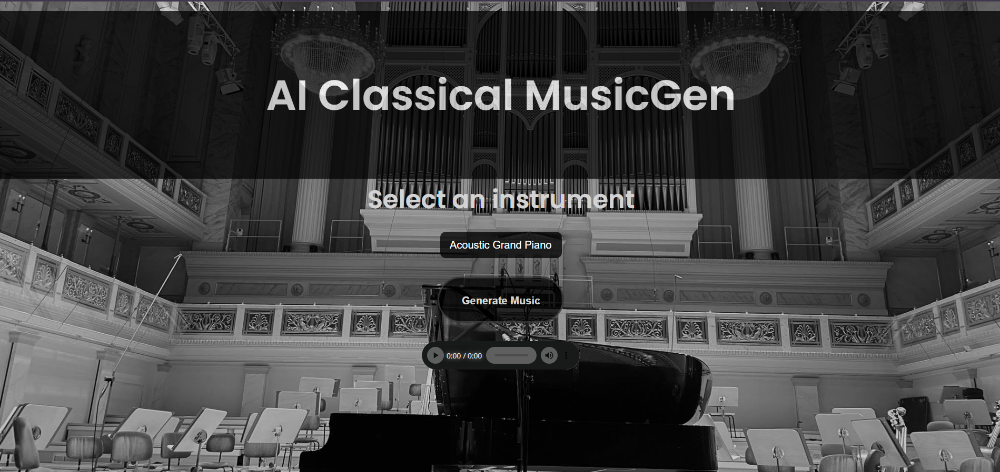
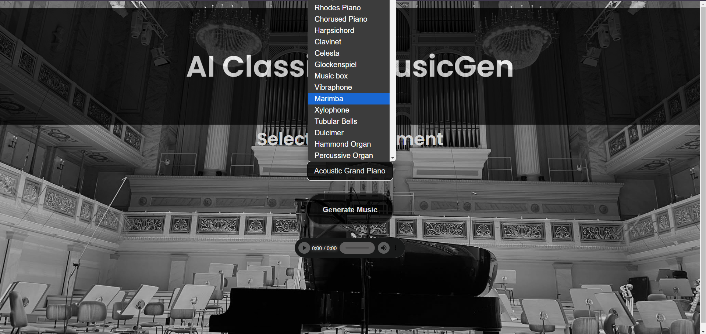
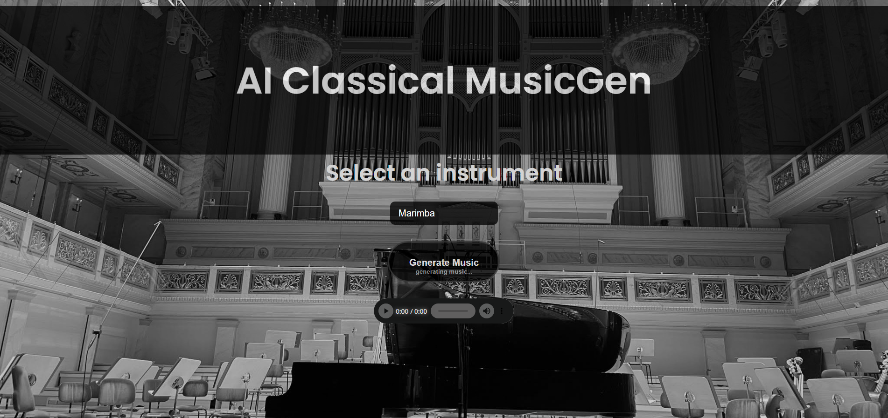

# Classical Music Generator using Deep Learning (LSTM)

This project was developed as part of a university group project for the AI module in the 6th semester. 
This project uses deep learning to generate classical music. It employs an LSTM (Long Short-Term Memory) model trained on the MusicNet dataset to create new musical compositions. 
The project includes a web interface for easy interaction and music generation, demonstrating the application of AI in creative domains.

Data Set - https://www.kaggle.com/datasets/imsparsh/musicnet-dataset

## Project Description

The **Classical Music Generator** uses LSTM, a type of recurrent neural network (RNN), to generate sequences of notes that resemble classical music. 
By training the model on a dataset of classical music pieces, the model learns patterns in the music and is able to generate new compositions.
To make this project more interactive, we also developed a **website** where users can select instruments and generate music in real-time. 
The website is hosted on an Amazon EC2 server (or you can use it locally using localhost) and integrates the LSTM model with a Flask API backend, while the frontend is built using HTML and CSS.

### Model Architecture 

- The model consists of three LSTM layers followed by dense layers for predicting pitch, step, and duration.
- Input shape: (25, 3), representing sequences of 25 timesteps, each with 3 features (pitch, step, duration)

### Training Process

The LSTM model was trained on sequences of notes extracted from classical music pieces. The training process involves,

- Data preprocessing to convert music files into sequences.
- Training the LSTM model to learn the patterns in the sequences.
- Generating new music by predicting the next note in a sequence based on the learned patterns.

### Technologies Used

- **Python**
- **TensorFlow** 
- **Kaggle** (for dataset hosting)

## Features

- Generate classical music sequences based on a trained LSTM model.
- Select different instruments on the website to generate music.
- Real-time music generation and playback on the website.
- Ability to download music pieces.

### Website

The website demonstrates the music generation feature in an interactive way:

 

- Users can select an instrument from the dropdown menu (e.g., piano, violin) from the interface.

- Once an instrument is selected, Click the "Generate Music" button.

- The Flask API communicates with the LSTM model to generate music accordingly.

- Users can listen to the generated music directly on the website.

### Dataset

 - The dataset used for training consists of classical music MIDI files obtained from Kaggle. The data was preprocessed and converted into sequences suitable for LSTM training.
 - Data Set - https://www.kaggle.com/datasets/imsparsh/musicnet-dataset

## Contributors

- **Sahan Lelwala**
- **Dushmin Malisha**
- **Sanjula Lakpahana**
- **Srijith Yaparathna**
